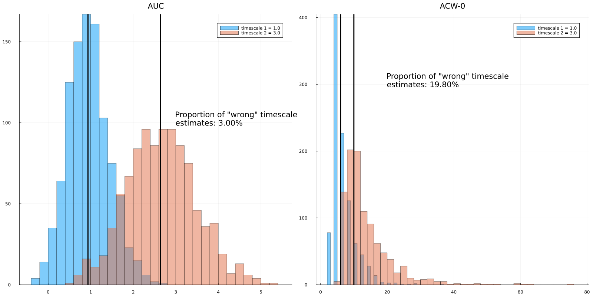
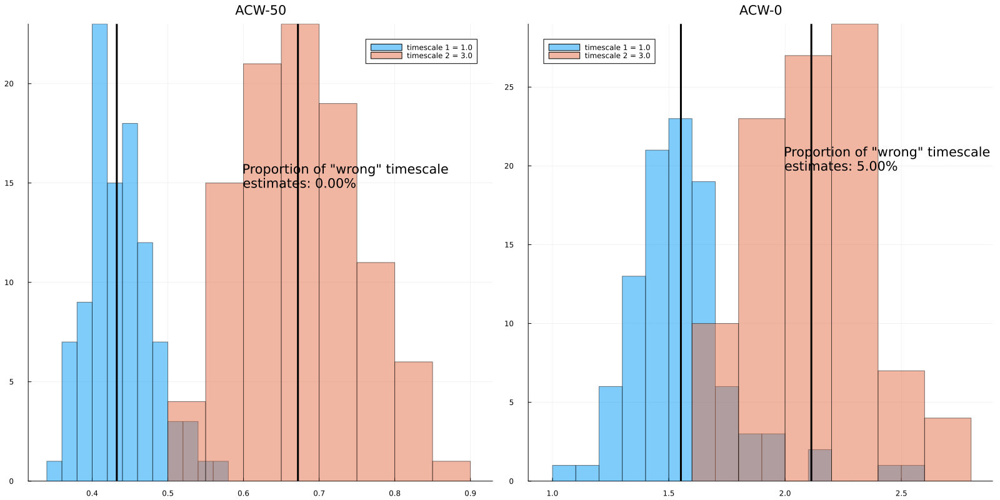

# Autocorrelation Windows

We finished the [previous section](practice_1_acf.md) with a discussion about how a determinstic statistic can be influenced by the limitations of our data. In this section, we will generalize the problem and discuss various autocorrelation window (ACW) types. 

First, some nomenclature. When we make an analysis on the data, for example, calculate event-related potentials, ACWs and so on, we are aiming for an _estimand_. In event-related potentials, our estimand is the stereotypical response of the brain to some cognitive task. In ACWs, our estimand is intrinsic neural timescales (INTs). The ACW we get is not INT per se, it is the _estimate_ of INT. To obtain the estimate, we use an _estimator_. The schema below shows the relationship. 


Our first note about the noise of estimators was the finiteness of the data. We noted that as we go along further lags, we have less data points at our hand to calculate the correlation values, making the estimate noisier. A first response to the problem is to use a different cutoff. Instead of waiting the autocorrelation function to reach exactly to 0 thus completely losing the similarity, we can cut it off when it reaches 0.5 and say losing half of the similarity. After all, a time-series with a longer timescale should take longer to lose half of it. This method is called ACW-50. It is  older than ACW-0. To my knowledge, used first in [Honey et al., 2012](https://pubmed.ncbi.nlm.nih.gov/23083743/). This was a time when the phrase intrinsic neural timescale had not been established. The term at that time was temporal receptive windows (TRW). I will discuss the evolution of the term more in the [Theory] section. For now, we will make simulations from two processes with different timescales and see how well we can distinguish their INTs using ACW-50 versus ACW-0. To quickly get many simulations with the same timescale, I will set num_trials to 1000 in the function [`generate_ou_process`](@ref). 

```julia
using IntrinsicTimescales # import IntrinsicTimescales package
using Random 
using Plots # to plot the results
Random.seed!(1) # for replicability

timescale_1 = 1.0
timescale_2 = 3.0
sd = 1.0 # sd of data we'll simulate
dt = 0.001 # Time interval between two time points
duration = 10.0 # 10 seconds of data
num_trials = 1000 # Number of trials

data_1 = generate_ou_process(timescale_1, sd, dt, duration, num_trials)
data_2 = generate_ou_process(timescale_2, sd, dt, duration, num_trials)
println(size(data_1)) # == 30, 1000: 30 trials and 10000 time points
```

To streamline the ACW calculation, I will use the [`acw`](../acw.md) function from INT.jl. This function takes your time series data, sampling rate and ACW types you want to calculate and returns the ACW values in the same shape of the data. Along with ACW results it also returns additional information that will be useful later. To extract ACW values, we will extract the field `acw_results` from the output of `acw`. It is best to demonstrate with an example. 

```julia
fs = 1 / dt # sampling rate
acwresults_1 = acw(data_1, fs, acwtypes=[:acw50, :acw0]) 
acwresults_2 = acw(data_2, fs, acwtypes=[:acw50, :acw0])
# Since we used the order [:acw50, :acw0], the first element of results is ACW-50, the second is ACW-0.
acw50_1 = acwresults_1.acw_results[1]
acw0_1 = acwresults_1.acw_results[2]
acw50_2 = acwresults_2.acw_results[1]
acw0_2 = acwresults_2.acw_results[2]
```

How to quantify the sensitivity of the estimator (to changes in the timescale)? Let's assume an experimental scenario where we are comparing INTs of two conditions or two groups. We are calculating one timescale from each condition. The number of trials (`num_trials` above) can refer to either number of trials or subjects. Then we'll compare the INTs from two groups. We know for a fact that first condition has a shorter timescale than the second since we set them ourselves in the code above (`timescale_1` and `_2`). We will calculate what percentage of the time we are wrong, that we are getting a longer or equal INT for the first condition and a shorter or equal INT for the second condition. 

Take a look at the code below, we will calculate what I described in the previous awful paragraph. Hopefully the code is cleaner than my English. Additionally, we will plot histograms to visualize the overlap between estimates. 

```julia
using Printf

bad_acw50_timescale = mean(acw50_2 .<= acw50_1) * 100
bad_acw0_timescale = mean(acw0_2 .<= acw0_1) * 100

# Plot histograms
p1 = histogram(acw50_1, alpha=0.5, label="timescale 1 = $(timescale_1)")
histogram!(p1, acw50_2, alpha=0.5, label="timescale 2 = $(timescale_2)")
# Plot the median since distributions are not normal
vline!(p1, [median(acw50_1), median(acw50_2)], linewidth=3, color=:black, label="") 
title!(p1, "ACW-50\n")
# Mad string manipulation
annotate!(p1, 1, 100, 
    (@sprintf("Proportion of \"wrong\" timescale \nestimates: %.2f%% \n", bad_acw50_timescale)), textfont=font(24), :left)
# ACW-0
p2 = histogram(acw0_1, alpha=0.5, label="timescale 1 = $(timescale_1)")
histogram!(p2, acw0_2, alpha=0.5, label="timescale 2 = $(timescale_2)")

vline!(p2, [median(acw0_1), median(acw0_2)], linewidth=3, color=:black, label="")
title!(p2, "ACW-0\n")
annotate!(p2, 2, 175, 
    (@sprintf("Proportion of \"wrong\" timescale \nestimates: %.2f%% \n", bad_acw0_timescale)), textfont=font(24), :left)
plot(p1, p2, size=(1600, 800))
```


It seems ACW-0 gives messier results. Needless to say, these results depend on the difference between real timescales and the amount of data. Feel free to change these parameters and investigate the results under different scenarios. So ACW-50 seems to be a better estimator at least in the setting we specified above. Is our work done then? First of all, we used a weird way to define "wrong". We've reduced the correctness to a binary choice of is something greater or smaller than other. We can be more principled than this and actually quantify how much we are off. We will do this in [the next section]. For now, let's consider another scenario. In the example above, we had `dt` = 0.001 implying our sampling rate (`fs`) is 1000 Hz and we have 10 seconds of data. This sounds like an EEG/MEG scenario. Let's try an fMRI scenario where we have a sampling rate of 0.5 Hz (corresponding TR=2 seconds) and 300 seconds of data. We'll set the timescales to 1 seconds and 3 seconds for short timescale and long timescale guys. 

```julia
timescale_1 = 1.0
timescale_2 = 3.0
sd = 1.0 
dt = 2.0 # Time interval between two time points
duration = 300.0 # 5 minutes of data
num_trials = 1000 # Number of trials

data_1 = generate_ou_process(timescale_1, sd, dt, duration, num_trials)
data_2 = generate_ou_process(timescale_2, sd, dt, duration, num_trials)

fs = 1 / dt # sampling rate
acwresults_1 = acw(data_1, fs, acwtypes=[:acw50, :acw0]) 
acwresults_2 = acw(data_2, fs, acwtypes=[:acw50, :acw0])
acw50_1 = acwresults_1.acw_results[1]
acw0_1 = acwresults_1.acw_results[2]
acw50_2 = acwresults_2.acw_results[1]
acw0_2 = acwresults_2.acw_results[2]

bad_acw50_timescale = mean(acw50_2 .<= acw50_1) * 100
bad_acw0_timescale = mean(acw0_2 .<= acw0_1) * 100

# Plot histograms
p1 = histogram(acw50_1, alpha=0.5, label="timescale 1 = $(timescale_1)")
histogram!(p1, acw50_2, alpha=0.5, label="timescale 2 = $(timescale_2)")
vline!(p1, [median(acw50_1), median(acw50_2)], linewidth=3, color=:black, label="") 
title!(p1, "ACW-50\n")
annotate!(p1, 1, 100, 
    (@sprintf("Proportion of \"wrong\" timescale \nestimates: %.2f%% \n", bad_acw50_timescale)), textfont=font(24), :left)
# ACW-0
p2 = histogram(acw0_1, alpha=0.5, label="timescale 1 = $(timescale_1)")
histogram!(p2, acw0_2, alpha=0.5, label="timescale 2 = $(timescale_2)")

vline!(p2, [median(acw0_1), median(acw0_2)], linewidth=3, color=:black, label="")
title!(p2, "ACW-0\n")
annotate!(p2, 2, 175, 
    (@sprintf("Proportion of \"wrong\" timescale \nestimates: %.2f%% \n", bad_acw0_timescale)), textfont=font(24), :left)
plot(p1, p2, size=(1600, 800))
```


Half the time, we got the wrong result with ACW-50! To diagnose the problem, let's plot the autocorrelation functions. This is where the other information stored in the output of [`acw`](../acw.md) comes useful. We'll use the function `acwplot` to plot the ACFs. This function plots the ACFs and returns a plot object which we can modify later. We'll put vertical lines at the lags where we compute autocorrelation. Note that the lags are also stored in the output of `acw`. To not plot 1000 ACFs for each trial, let's resimulate data with a reasonable number of trials. 

```julia
num_trials = 20 # Number of trials
data_1 = generate_ou_process(timescale_1, sd, dt, duration, num_trials)
data_2 = generate_ou_process(timescale_2, sd, dt, duration, num_trials)
acwresults_1 = acw(data_1, fs, acwtypes=[:acw50, :acw0]) 
acwresults_2 = acw(data_2, fs, acwtypes=[:acw50, :acw0])
p = acwplot(acwresults_1)
vline!(p, [acwresults_1.lags], linewidth=3, color=:black, label="")
```


The autocorrelation is dropping below 0.5 before even 2 seconds pass. And because our time resolution was two seconds, most of the autocorrelation functions drop below 0.5 even before we can calculate ACW-50. 

There is one more method in case ACW-50 is not working well. Let's consider the case above: we want to be able to distinguish the processes but we don't have the time resolution to use ACW-50. We can use ACW-0 but the later lags are more noisy. Wouldn't it be great if we had a method that assigns higher weights to earlier lags and lower weight to less reliable later lags? Turns out there is one such method. We can calculate the area under the curve (AUC) of the ACF. Since later lags have less correlation, their contribution to the area under the curve will be less. In IntrinsicTimescales.jl, we can use `:auc` to calculate the AUC of ACF before ACF touches 0. Under the hood, this method uses [Romberg.jl](https://github.com/fgasdia/Romberg.jl) to use Romberg's method. This method is [orders of magnitude more accurate](https://young.physics.ucsc.edu/115/romberg.pdf) than trapezoid (as in np.trapz or MATLAB trapz) and Simpson's methods (as in scipy.integrate.simpson). Let's repeat the above experiment to compare ACW-0 and AUC methods:

```julia
timescale_1 = 1.0
timescale_2 = 3.0
sd = 1.0 
dt = 2.0 # Time interval between two time points
duration = 300.0 # 5 minutes of data
num_trials = 1000 # Number of trials

data_1 = generate_ou_process(timescale_1, sd, dt, duration, num_trials)
data_2 = generate_ou_process(timescale_2, sd, dt, duration, num_trials)

fs = 1 / dt # sampling rate
acwresults_1 = acw(data_1, fs, acwtypes=[:auc, :acw0]) 
acwresults_2 = acw(data_2, fs, acwtypes=[:auc, :acw0])
auc_1 = acwresults_1.acw_results[1]
acw0_1 = acwresults_1.acw_results[2]
auc_2 = acwresults_2.acw_results[1]
acw0_2 = acwresults_2.acw_results[2]

bad_auc_timescale = mean(auc_2 .<= auc_1) * 100
bad_acw0_timescale = mean(acw0_2 .<= acw0_1) * 100

# Plot histograms
p1 = histogram(auc_1, alpha=0.5, label="timescale 1 = $(timescale_1)")
histogram!(p1, auc_2, alpha=0.5, label="timescale 2 = $(timescale_2)")
vline!(p1, [median(auc_1), median(auc_2)], linewidth=3, color=:black, label="") 
title!(p1, "AUC\n")
annotate!(p1, 3, 100, 
    (@sprintf("Proportion of \"wrong\" timescale \nestimates: %.2f%% \n", bad_auc_timescale)), textfont=font(24), :left)
# ACW-0
p2 = histogram(acw0_1, alpha=0.5, label="timescale 1 = $(timescale_1)")
histogram!(p2, acw0_2, alpha=0.5, label="timescale 2 = $(timescale_2)")

vline!(p2, [median(acw0_1), median(acw0_2)], linewidth=3, color=:black, label="")
title!(p2, "ACW-0\n")
annotate!(p2, 20, 300, 
    (@sprintf("Proportion of \"wrong\" timescale \nestimates: %.2f%% \n", bad_acw0_timescale)), textfont=font(24), :left)
plot(p1, p2, size=(1600, 800))
```


We've reduced the "wrong" estimates to 1.20%, quite impressive! 

It seems different modalities and temporal resolutions call for different ways to calculate ACW. But even with the _better_ estimator, we can still be off 1/5th of the time. Can we do better? Remember the coin flipping experiment from [the previous section]. We said that if we repeat the experiment again and again and take average across experiments, our estimates get better. Let's do this in the context of ACW-50. In the code below, I will first make 1000 simulations, then from each one of them, I'll calculate one autocorrelation function. Then I'll cumulatively average those autocorrelation functions, i.e. I'll average the first two ACFs, the first three, the first four... Then I'll calculate ACW-50 and ACW-0 from each step. Let's see if they are converging. 

```julia
using Statistics, IntrinsicTimescales, Plots, Random
Random.seed!(123)
timescale = 3.0
sd = 1.0 # sd of data we'll simulate
dt = 0.001 # Time interval between two time points
fs = 1 / dt
duration = 10.0 # 10 seconds of data
num_trials = 1
acfs = []
acw50s = []
acw0s = []
n_experiments = 1000
for _ in 1:n_experiments
    data = generate_ou_process(timescale, sd, dt, duration, num_trials)
    acf = comp_ac_fft(data[:])
    push!(acfs, acf)
    current_mean_acf = mean(acfs)
    lags = (0:(length(current_mean_acf)-1)) * dt
    current_acw50 = acw50(lags, current_mean_acf)
    current_acw0 = acw0(lags, current_mean_acf)
    push!(acw50s, current_acw50)
    push!(acw0s, current_acw0)
end
p1 = plot(acw50s, label="ACW-50", xlabel="Iterations", ylabel="ACW")
p2 = plot(acw0s, label="ACW-0", xlabel="Iterations", ylabel="ACW")
plot(p1, p2, size=(800, 400))
```


Note that it takes about 250 trials for the estimates to completely stabilize. This is a huge number. In the case above, we assumed that each trial is 10 seconds. 250 trials x 10 seconds is 41 minutes of data which we usually don't have. Nonetheless, even averaging across a couple trials makes the estimates much closer to the stabilized estimate. This is why the [Honey et al.](https://pubmed.ncbi.nlm.nih.gov/23083743/) paper I mentioned above calculated one ACF from 20 seconds of data and averaged over ACFs. In IntrinsicTimescales.jl, this is handled by the argument `average_over_trials` in the `acw` function. It is your responsibility to put your data in a format where one dimension is trials and one dimension is time. This is usually handled with [MNE](https://mne.tools/stable/index.html) or [FieldTrip](https://www.fieldtriptoolbox.org/) helper functions (see for example [mne.make_fixed_length_epochs](https://mne.tools/1.7/generated/mne.make_fixed_length_epochs.html), [this tutorial from MNE](https://mne.tools/stable/auto_tutorials/epochs/60_make_fixed_length_epochs.html) or [ft_redefinetrial](https://github.com/fieldtrip/fieldtrip/blob/master/ft_redefinetrial.m). If you think taking continuous data and segmenting with different overlap degrees would be useful for you in IntrinsicTimescales.jl, [open an issue on github](https://github.com/duodenum96/IntrinsicTimescales.jl/issues) and I can add this as a feature.). Before finishing this section, let's run one final experiment where we now have 20 trials for each subject and 100 subjects. Let's do a t-test between the groups and see if we can capture the difference. To run the code below, you'll need to install the Julia package [HypothesisTests](https://juliastats.org/HypothesisTests.jl/stable/). 

```julia
using HypothesisTests
Random.seed!(123)
n_subjects = 100
n_trials = 20
num_trials = 20
timescale_1 = 1.0
timescale_2 = 3.0
sd = 1.0
dt = 0.001
fs = 1 / dt
duration = 10.0

acw50_1 = Float64[] # HypothesisTests doesn't accept Vector{Any} type, requires Vector{<:Real} type
acw50_2 = Float64[]
acw0_1 = Float64[]
acw0_2 = Float64[]
for _ in 1:n_subjects
    data_1 = generate_ou_process(timescale_1, sd, dt, duration, num_trials)
    data_2 = generate_ou_process(timescale_2, sd, dt, duration, num_trials)
    acwresults_1 = acw(data_1, fs, acwtypes=[:acw50, :acw0], average_over_trials=true)
    acwresults_2 = acw(data_2, fs, acwtypes=[:acw50, :acw0], average_over_trials=true)
    current_acw50_1 = acwresults_1.acw_results[1]
    current_acw50_2 = acwresults_2.acw_results[1]
    current_acw0_1 = acwresults_1.acw_results[2]
    current_acw0_2 = acwresults_2.acw_results[2]
    push!(acw50_1, current_acw50_1)
    push!(acw50_2, current_acw50_2)
    push!(acw0_1, current_acw0_1)
    push!(acw0_2, current_acw0_2)
end

bad_acw50_timescale = mean(acw50_2 .<= acw50_1) * 100
bad_acw0_timescale = mean(acw0_2 .<= acw0_1) * 100

# Plot histograms
p1 = histogram(acw50_1, alpha=0.5, label="timescale 1 = $(timescale_1)")
histogram!(p1, acw50_2, alpha=0.5, label="timescale 2 = $(timescale_2)")
# Plot the median since distributions are not normal
vline!(p1, [median(acw50_1), median(acw50_2)], linewidth=3, color=:black, label="") 
title!(p1, "ACW-50\n")
annotate!(p1, 0.6, 25, 
    (@sprintf("Proportion of \"wrong\" timescale \nestimates: %.2f%% \n", bad_acw50_timescale)), textfont=font(24), :left)
# ACW-0
p2 = histogram(acw0_1, alpha=0.5, label="timescale 1 = $(timescale_1)")
histogram!(p2, acw0_2, alpha=0.5, label="timescale 2 = $(timescale_2)")

vline!(p2, [median(acw0_1), median(acw0_2)], linewidth=3, color=:black, label="")
title!(p2, "ACW-0\n")
annotate!(p2, 2, 30, 
    (@sprintf("Proportion of \"wrong\" timescale \nestimates: %.2f%% \n", bad_acw0_timescale)), textfont=font(12), :left)
plot(p1, p2, size=(1600, 800))

println(UnequalVarianceTTest(acw50_1, acw50_2))
println(UnequalVarianceTTest(acw0_1, acw0_2))
```



Note that our wrong estimates for ACW-50 reduced to 0! ACW-0 is still slightly noisy but much better now. You can also check out the t-test results, both ACWs returned a significant difference. This approach offers a way to see how many subjects you need to get a significant difference if your hypothesis is right. You can copy-paste the script above to play around with it when designing experiments and figuring out the number of subjects you need for different effect sizes. 

This was a long tutorial. Take a deep breath, make a coffee for yourself, go for a walk and come back for the next one. There is still work to do: we need to figure out how to calculate exactly how wrong are we. Under certain assumptions, we can actually do this. But we need some theoretical tools. In the [next section], We'll develop those theoretical tools and they will motivate us to calculate ACW in different ways.  