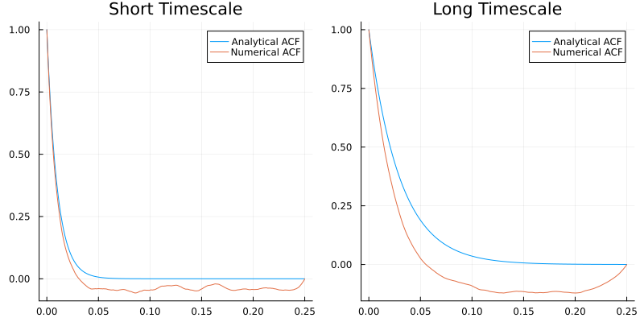

# Ornstein-Uhlenbeck Process as a Generative Model for ACF (Or Mommy, Where Do the ACFs Come From?)

Despite popular belief, ACFs aren't delivered by storks. So far, we just assumed that they exist and calculated ACW metrics from them. This is where we start building a more comprehensive theory. I will keep the math to a minimum and whenever I explain math, I will supplement it with code so that you can play with to get some intuition. 

Let's get right into it. You have some data and from that data you can calculate an autocorrelation function. But what is the most minimal, simplest ground truth that can generate the data that you see? This is a very hard question and the discipline of theoretical neuroscience tries to answer it ([Neuronal Dynamics](https://neuronaldynamics.epfl.ch/) by Gerstner et al. is an excellent starting place for the curious). An easier question is what is the simplest ground truth that can generate the _autocorrelation function_ that you observe in the data? Then we can ask how can we think of the ACF beyond a bunch of numbers. One way to think about ACF is to think of it as an exponential decay function. Here is the math + code:

```math
\textrm{ACF}(l) = e^{-\frac{l}{\tau}}
```

```julia
using Plots
dt = 0.0001 # time resolution
lags = (0:2500) * dt # x axis
tau_short = 0.01 # short timescale
tau_long = 0.03 # long timescale
acf_short = exp.(-lags ./ tau_short)
acf_long = exp.(-lags ./ tau_long)
plot(lags, acf_short, label="Short Timescale ACF")
plot!(lags, acf_long, label="Long Timescale ACF")
```


Compare this with the ACFs we plotted in the previous tutorials. An exponential decay function is an abstraction of the ACF. In the equation above, we represent the lags with ``l`` and timescale with ``\tau``. As expected, as I increase ``\tau`` (`tau`), the ACF decays slower. You can eyeball the ACW-50. We can do better than eyeballing. Let's do high-school math to get the ACW-50. Remember the definition: ACW-50 is the lag where ACF crosses 0.5:

```math
e^{-\frac{l}{\tau}} = 0.5
```

We need to solve this for ``l``. Remember that the inverse of an exponential is a logarithm. Taking the logarithm of both sides:

```math
\log{e^{-\frac{l}{\tau}}} = \log{0.5}
-\frac{l}{\tau} = \log{0.5}
l = -\tau \log{0.5}
l = -\tau \log{2^{-1}}
l = \tau \log{2}
\textrm{ACW-50} = \tau \log{2}
```

That's it! We effectively showed that ACW-50 is just the timescale or decay rate of the autocorrelation function up to a constant which is ``\log{2}``. This is good, but the data we have is not just an autocorrelation function. It is the whole time series. The next step is to figure out the generative model for the time-series which gives this autocorrelation function. I will explain the birds and bees of this in the [Theory] section but even pure practicioners need to know a minimum of theory to understand what they practice. The minimum of theory is the mysterious thing that I shied away from explaining properly, the Ornstein-Uhlenbeck (OU) process. The function [`generate_ou_process`](@ref) that we used again and again without explaining. No more. Here is the OU:

```math
\frac{dx(t)}{dt} = -\frac{1}{\tau} x(t) + \xi (t)
```

This equation is called a differential equation. On the left hand side, you have a derivative (the ``\frac{d}{dt}`` term). ``t`` denotes time here. You have the rate of change of something (``x``) with respect to time. That is, how does ``x`` change when time changes. ``x`` is your dynamic variable or your observable: what you observe in data. To see how it changes, look at the right hand side. The first term is ``-\frac{1}{\tau} x(t)``. ``\tau`` is the timescale. This term ensures that your ``x`` always moves to 0. To see how, note that ``\tau`` is always positive. If you give a positive number to ``x``, the ``-`` sign will make sure that ``x`` decreases with time. If ``x`` reduces too much, becomes negative, then the ``-`` sign will again ensure that ``x`` increases to move it towards zero because if you put a ``-`` sign in front of a negative number, it becomes positive (as in ``-(-3) = +3``). The final term, ``\xi (t)`` ensures that your ``x`` doesn't get stuck at zero. This term is called white noise: it is a random number drawn from a Gaussian distribution. How does this all relate to timescales? Let's ask the question: how fast ``x`` approaches zero? Well, this is determined by ``\frac{1}{\tau}`` in front of it. Higher the ``\tau``, slower the approach because ``\frac{1}{\textrm{big number}}`` is a small number and vice versa. If you feel uncomfortable with the mathematics I present here, I invite you to pull up a pen and paper and plug in different numbers. It'll become clear. There is no better way to build intuition other than grinding your way through intuition and [forcing your way through its wooden doors with a battering ram](https://www.youtube.com/watch?v=PLxXC-V8wLs). 

Back to `generate_ou_process`. What this function does is that it solves this equation. What does it mean to solve an equation? There are a number of ways to approach an equation of this type: one can take averages of both sides, calculate moments, use a Fokker-Planck approach, apply perturbation theory via Martin-Siggia-Rose-De Dominicis-Janssen path integral, apply Fourier analysis, use Ito or Stratonovich calculus. `generate_ou_process` takes a numerical approach: it assigns a random initial number as a starting condition and moves ``x`` forward in small steps according to the equation. Under the hood, it uses the amazing [DifferentialEquations.jl] library which is optimized to the bone, this is why it is fast. Since we solve the equation for ``x(t)``, the end result is a time-series. Under ideal conditions (that is, sufficiently enough data), if you calculate the autocorrelation function of this time-series, you will get an exponential decay function of the same type above. Let's test this with the tools that we are hopefully familiar with now:

```julia
using IntrinsicTimescales, Statistics
sd = 1.0
duration = length(lags) * dt # match the number of lags
num_trials = 100
n_lags = length(lags)
data_short_ts = generate_ou_process(tau_short, sd, dt, duration, num_trials)
data_long_ts = generate_ou_process(tau_long, sd, dt, duration, num_trials)
# average over trials to get a less noisy ACF
acf_numerical_short = mean(comp_ac_fft(data_short_ts), dims=1)[:]
acf_numerical_long = mean(comp_ac_fft(data_long_ts), dims=1)[:]
p1 = plot(lags, acf_short, label="Analytical ACF", title="Short Timescale")
plot!(p1, lags, acf_numerical_short, label="Numerical ACF")
p2 = plot(lags, acf_long, label="Analytical ACF", title="Long Timescale")
plot!(p2, lags, acf_numerical_long, label="Numerical ACF")
plot(p1, p2, size=(800,400))
```



Note that the numerical ACF estimate decays consistenly faster than the analytical ground truth. The difference between the numerical estimate and analytical one increases as timescale increases. This is a limitation of finite data. As long as your data is finite and has a sampling rate that is not infinitesimally small, you will underestimate the INT. We will address this problem in the [final tutorial of Practice]. 

The good thing is even though we are underestimating the INT, the ACF of the long timescale process still decays slower than the short timescale one. 

This theoretical knowledge motivates two more ACW types. The first one is the lag where ACF crosses ``1/e``. In IntrinsicTimescales.jl, this is called `acweuler` (or ACW-e) but I'm not sure if there is a generic name for it in the literature. The math: 

```math
e^{-\frac{l}{\tau}} = \frac{1}{e}
\log{e^{-\frac{l}{\tau}}} = \log{\frac{1}{e}}
-\frac{l}{\tau} = -1
l = \tau
```

Assuming that your autocorrelation function is a perfect exponential decay, then calculating ACW-e directly gives you the timescale ``\tau``. Alternatively, we can fit an exponential decay function to our autocorrelation function and get the decay rate. IntrinsicTimescales.jl uses the Julia package [NonlinearSolve.jl](https://docs.sciml.ai/NonlinearSolve/stable/) for the fitting. In IntrinsicTimescales.jl, this metric is called `tau`. Note that by default, IntrinsicTimescales.jl cuts the tail of the ACF before fitting. Remember that the ACF estimate gets noisier as we have less and less data for longer lags. If we keep all the ACF, we might fit to the noise as well. By default, the lag where the ACF is cut is `1.1*acw0`. You can change this by the parameter `n_lags`. In the code example below, I show the two methods. 

```julia
fs = 1 / dt
acwresults_short = acw(data_short_ts, fs, acwtypes=[:acweuler, :tau], average_over_trials=true)
acwresults_long = acw(data_long_ts, fs, acwtypes=[:acweuler, :tau], average_over_trials=true)
acw_e_short, acw_tau_short = acwresults_short.acw_results
acw_e_long, acw_tau_long = acwresults_long.acw_results
println("Short timescale: $(tau_short)")
# 0.01
println("ACW-e estimate of short timescale: $(acw_e_short)")
# 0.0091
println("Curve-fitting estimate of short timescale: $(acw_tau_short)")
# 0.0088
println("Long timescale: $(tau_long)")
# 0.03
println("ACW-e estimate of long timescale: $(acw_e_long)")
# 0.0214
println("Curve-fitting estimate of long timescale: $(acw_tau_long)")
# 0.02
```

So far, we always assumed that the ACF is a nice exponential decay. This is rarely the case for EEG/MEG data where oscillatory brain activity (alpha oscillations for example) makes a considerable impact on ACF. We will learn how to deal with it in the next section. 