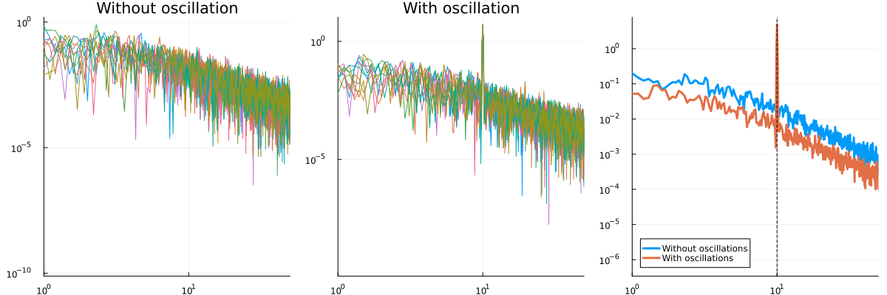

# Dealing with Oscillatory Artifacts using Fourier Transformation

So far, we only dealt with autocorrelation functions (ACFs) that are of exponential decay type. This is fine for fMRI data but can be problematic for EEG/MEG data. To demonstrate, I'll use the function [`generate_ou_with_oscillation`](@ref). This function adds an oscillation on top of an Ornstein-Uhlenbeck process. It takes three parameters for its generative model: timescale, oscillation frequency and coefficient for OU process (meaning higher the coefficient, lower the oscillatory artifact). The coefficient is bounded between 0 and 1. If you try to give it a coefficient that is greater than 1 or smaller than 0, it will change it to 1 and 0 respectively. It also takes the desired mean and sd for data. This is required for Bayesian estimation of timescales which will be the topic of next tutorial. Consider the following code. I'll simulate two time-series, with and without oscillatory artifacts and calculate ACW-e which I introduced in the previous section. 

```julia
using IntrinsicTimescales, Plots, Random, Statistics
Random.seed!(666) # for reproducibility
fs = 1000.0 # 1000 Hz sampling rate
dt = 1.0 / fs
duration = 10 # 10 seconds of data
num_trials = 10
data_mean = 0.0 # desired mean
data_sd = 1.0 # desired sd

timescale = 0.1 # 100 ms
oscillation_freq = 10.0 # 10 Hz alpha oscillation
coefficient = 0.95
theta = [timescale, oscillation_freq, coefficient] # vector of parameters

data_osc = generate_ou_with_oscillation(theta, dt, duration, num_trials, data_mean, data_sd)
data = generate_ou_process(timescale, data_sd, dt, duration, num_trials)
acwresults_osc = acw(data_osc, fs; acwtypes=:acweuler)
acwresults = acw(data, fs; acwtypes=:acweuler)
println(mean(acwresults_osc.acw_results))
# 0.087
println(mean(acwresults.acw_results))
# 0.3075
p1 = acwplot(acwresults_osc)
title!(p1, "ACF with oscillatory component")
p2 = acwplot(acwresults)
title!(p2, "ACF")
plot(p1, p2)
```


The ACW calculated from the simulation with the oscillatory component is terribly off. A good question is why do we see oscillations in the ACF (note the wiggles)? Remember that ACF is calculating the correlation of your data with your data shifted by a certain lag. If you consider a perfect oscillation, its correlation with itself will fluctuate. Whenever the peaks and troughs of oscillation correspond to peaks and troughs of the shifted oscillation (which will happen periodically, when you shift the oscillation just right enough so that it matches with itself), it will nicely correlate with itself. If you shift it half the period of oscillation, so that the peaks of the oscillation will match the troughs of the shifted oscillation, it will have a negative autocorrelation. (Try to draw this on your notebook to get a clearer picture). As a result, the ACF of a perfect oscillation is another oscillation. But oscillation here is also coupled with the OU process. Hence the exponential decay + oscillation type of ACF. 

We need to find a way to decouple the oscillation from the OU process. There is a mathematical technology for this, called the Fourier transform. Essentially it is the correlation of a signal with an oscillation. Let's write down the math. 

```math
\tilde{f}(\omega) = \int_{-\infty}^{\infty}f(t)e^{-i\omega t} dt=\int_{-\infty}^{\infty}f(t)(\cos{\omega t} - i \sin{\omega t}) dt
```

The first equality is the definition of the Fourier transform. The second equality comes from [Euler's formula](https://en.wikipedia.org/wiki/Euler%27s_formula). The term ``\cos{\omega t} +i \sin{\omega t}`` is a cosine wave with frequency ``\omega`` and its complex counterpart ``i \sin{\omega t}``. The complex part is there to carry the [phase information](https://math.stackexchange.com/questions/275115/why-do-fourier-transforms-use-complex-numbers) elegantly. Compare this with the formula for covariance of two zero-mean signals ``x(t)`` and ``y(t)``. Remember that covariance is a correlation that is not normalized between -1 and 1. I will also ignore dividing it by the number of elements in your vector (as in averaging). 

```math
\textrm{cov}(x, y) = \sum_t{x_ty_t}
```

For every time point ``t``, we multiply ``x`` and ``y`` at that time point, and add all the values we obtained from multiplication. Time is discrete here, as in our data. ``x_t`` corresponds to t-th data point of vector ``x``. Let's make time continuous. We will go from ``x_t`` to ``x(t)`` to note that we can put any ``t`` there, not just the elements of a vector. The discrete summation ``\sum`` will then be replaced by a continuous sum denoted by the integral sign ``\int dt``. 

```math
\sum_t{x_ty_t} \rightarrow \int x(t)y(t) dt
```

The boundaries of the integral are defined by your data. Theoretically, we set them as ``-\infty`` and ``\infty``. To get the final piece, replace ``y(t)`` by our complex sinusoid:

```math
\int x(t)y(t) dt \rightarrow \int_{-\infty}^{\infty}x(t)(\cos{\omega t} - i \sin{\omega t}) dt \\

\tilde{x}(\omega) = \int_{-\infty}^{\infty}x(t)(\cos{\omega t} - i \sin{\omega t}) dt = \int_{-\infty}^{\infty}x(t)e^{-i \omega t} dt
```

Compare this with the definition of Fourier transform above. We denote the Fourier transform of ``x(t)`` as ``\tilde{x}(\omega)``. When we sum over the variable ``t`` denoting time, that variable disappears. For every time value, we did a multiplication and added the results of those multiplications. There is no time anymore, we picked all of them. We do this for every frequency ``\omega``. For frequency ``\omega``, we have ``\tilde{x}(\omega)``. This is why when people talk about Fourier transform, they talk about going from time domain to the frequency domain. You remove the indices of time and replace it with indices of frequency. 

Remember our initial starting point: covariance = non-normalized correlation. We are seeing how much our data correlates with a certain frequency. But there is still an annoying part: the complex term with the funny ``i`` number in it. Correlation or covariance values need to be real numbers, not imaginary. To resolve this dilemma, we can calculate the magnitude of complex numbers. This would take care of the complex part and give us a real number. In your computer, this is defined as the ``abs`` function, corresponding to absolute value. In general:

```math
z = a + ib \\

abs(z) = |z|=\sqrt{a^2+b^2}
```

Finally, we can remove the annoying square root symbol by taking the square of the absolute value. If the square root of something is big, then something got to be big as well. Why bother with square rooting it. These series of handwaving arguments finally lead us to the definition of the power spectrum: the squared magnitude of the fourier transform.

```math
\textrm{PSD}(\tilde{x}(\omega)) = |\tilde{x}(\omega)|^2
```

Clearly, the power spectrum is a function of frequency ``\omega``. For every value of ``\omega``, we have one covariance number. The natural way to represent this is to put the frequencies on the x axis and the covariance values on the y axis. 

Why did we bother with all this. Remember our initial problem. We want to take out the frequency from the rest of the signal so that our timescale estimates are clean. The Fourier transform does exactly that. By moving from time domain to frequency domain, we can pinpoint the oscillations. The power spectrum shows exactly that. IntrinsicTimescales.jl has a bunch of functions to do this: `comp_psd` for periodogram, `comp_psd_adfriendly` is an automatic-differentiation friendly version of this (which we'll use in the next section) and `comp_psd_lombscargle` takes care of the missing data points using Lomb-Scargle periodogram if your data has missing values in it represented by `NaN`s. In practice, `acw` function wraps all these and picks the appropriate one for you. Let's plot the two power spectra for our data with and without oscillations. The third plot shows the average across trials. I'll plot on log scale, it is usually easier on the eyes for power spectra. Feel free to remove the `scale=:log10` to see them raw. 

```julia
psd, freqs = comp_psd(data, fs)
psd_osc, freqs = comp_psd(data_osc, fs)
p1 = plot(freqs, psd', scale=:log10, label="", title="Without oscillation")
xlims!(p1, (1.0, 50.0)) # limit to frequencies between 1 and 50 Hz
p2 = plot(freqs, psd_osc', scale=:log10, label="", title="With oscillation")
xlims!(p2, (1.0, 50.0))
p3 = plot(freqs, mean(psd', dims=2), scale=:log10, 
          linewidth=3, label="Without oscillations", legend_position=:bottomleft)
plot!(freqs, mean(psd_osc', dims=2), scale=:log10, 
      linewidth=3, label="With oscillations", legend_position=:bottomleft)
xlims!(p3, (1.0, 50.0))
vline!(p3, [10.0], color=:black, linewidth=1, label="", linestyle=:dash)
plot(p1, p2, p3, size=(1200, 400), layout=(1, 3))
```



See that huge peak? The correlation with a 10 Hz oscillation and our data is high because our data has a 10 Hz oscillation. That's nice. But what does it have to do with timescales? 

It is not a coincidence that both autocorrelation and power spectrum are defined in terms of correlations. Correlation with your data with itself and correlation of your data with sinusoids. It would be really nice if there was a way to connect them. Thankfully, there is. Wiener-Khinchin theorem states that the inverse Fourier transform of a power spectrum is the autocorrelation function. Which also means that the Fourier transform of an autocorrelation function is the power spectrum. Showing this is not too difficult but we already did too much math for a documentation page. For the curious reader, I'll link this nice and short [proof](https://mathworld.wolfram.com/Wiener-KhinchinTheorem.html). Nonetheless, take a look at the source code of the function [`comp_ac_fft`](@ref), you'll see this theorem in action. Because Fourier transform on a computer is super fast (hence the name: Fast Fourier Transform, FFT), this function is way faster than [`comp_ac_time`](@ref) which calculates the ACF by shifting the time-series again and again and calculating correlation. And the really nice thing is the two functions are not approximations of each other. They are exactly the same, up to a floating point error on the order of ``10^{-16}``. You can see this in [one of the test files for the package](https://github.com/duodenum96/IntrinsicTimescales.jl/blob/master/test/test_summary_stats.jl). 

How can we utilize this information to get the timescale? Let's assume that our ACF is an exponential decay and calculate its Fourier transform. This is not an easy integral, I won't explain how to do it here (a.k.a. I will use the technique of integration by trust me bro). A nice explanation is given [here](https://mathworld.wolfram.com/FourierTransformExponentialFunction.html). 

```math
\textrm{ACF}(l) = e^{-\frac{l}{\tau}} \\

\tilde{\textrm{ACF}}(\omega) = \textrm{PSD}(\omega) = \frac{A}{k^2 + \omega^2} \\

k = \frac{1}{2 \pi \tau} \\

\tau = \frac{1}{2 \pi k}
```

``\frac{A}{a^2 + \omega^2}`` is called a Lorentzian. The ``A`` term upstairs is just a normalization factor, not particularly interesting. ``\omega`` is our usual frequency. We also see that the timescale ``\tau`` is in there as well. This means that we need only to fit this Lorentzian to our power spectrum and we have access to timescale ``\tau``. To my knowledge, this technique was first introduced in [Chaudhuri et al., 2017](https://academic.oup.com/cercor/article/28/10/3610/4508768) and further developed in [Gao et al., 2020](https://elifesciences.org/articles/61277) to cover the cases where the exponent of ``omega`` downstairs is not exactly 2. Since version 0.3.0, IntrinsicTimescales.jl supports both methods via the keyword  argument `allow_variable_exponent`. The default behavior for this is false, which sets the exponent to 2. This should cover most cases. If you are getting funny results, I recommend setting `allow_variable_exponent=true` (e.g. `acw(data, fs; acwtypes=:knee, allow_variable_exponent=true)`). Yet another thing to note is the issue of constraints. In general, unconstrained problems, i.e. the problems where the parameters (for example the knee frequency) can take any possible value are solved more effectively. However, for hard problems, this can lead to the algorithm cheating by finding parameter combinations that are physically unrealistic (for example, negative frequencies for the knee frequency). The way to avoid this is by using the keyword argument `constrained`. When this is set to `true`, IntrinsicTimescales.jl switches the algorithm and the parameters are bounded in a realistic domain. See more details at [`acw`](@ref). 

Some interesting remarks. Consider very low frequencies: ``\omega \ll k``. When ``\omega`` is small, then ``\omega^2`` will be much smaller compared to ``k^2`` (think of if 2 is smaller than 3, then ``2^2=4`` is much smaller than ``3^2=9``). Then we can ignore the `\omega` term and our PSD reduces to ``\frac{A}{k^2}`` which is just a constant. Now consider big frequencies: ``\omega \gg k``. Since ``\omega`` is big, ``\omega^2`` is now much bigger than ``k`` and we can ignore ``k``. Then the power spectrum is ``\frac{A}{\omega^2}``. This is the so-called _scale-free_ power spectrum with a power-law exponent (PLE) of 2. If we take the logarithm, ``\log{\frac{A}{\omega^2}} \sim -2\omega`` meaning on the log-scale, we should see a straight line with a slope of 2. Right in between, there is a transition from a flat PSD to PLE=2 PSD. This is where ``k`` is approximately equal to ``\omega``. Alternatively, the frequency between the flat part and the PLE=2 part is the _knee frequency_ and also corresponds to your timescale up to a multiplicative constant. 

In IntrinsicTimescales.jl, you can use `:knee` in the acwtypes argument of [`acw`](../acw.md) to calculate the INT from the knee frequency. In the code below, I'll show this and plot the PSDs on the log scale to visually show the knee frequency. The function `knee_from_tau` converts the timescale to the knee frequency. 

```julia

acwresults_osc = acw(data_osc, fs; acwtypes=:knee, average_over_trials=true)
acwresults = acw(data, fs; acwtypes=:knee, average_over_trials=true)
println(mean(acwresults_osc.acw_results))
# 0.0795
println(mean(acwresults.acw_results))
# 0.0757
p1 = acwplot(acwresults_osc)
title!(p1, "ACF with oscillatory component")
p2 = acwplot(acwresults)
title!(p2, "ACF")
vline!(p1, [knee_from_tau(acwresults_osc.acw_results)], color=:black, linewidth=1, label="Knee frequency", linestyle=:dash)
vline!(p2, [knee_from_tau(acwresults.acw_results)], color=:black, linewidth=1, label="Knee frequency", linestyle=:dash)
plot(p1, p2, size=(800, 500))
```


We're almost there. In the final chapter, we will cover Bayesian estimation of INTs and finish the Practice part of the documentation. 

#### Bonus: Why does complex numbers in Fourier transform relate to phase?

I felt guilty after waving my hands too much when trying to convince you that we really need complex numbers to get the phase information. For the curious, here is a proper explanation. 

Consider the cosine wave ``g(t)=A \cos{(ft+\phi)}`` with amplitude ``A``, frequency ``f`` and phase shift ``\phi``. We'll take the Fourier transform of this guy. Let's start with writing it as in exponential form because dealing with trigonometric functions is annoying. Using Euler's formula:

```math
\textrm{Euler's Formula}: e^{ix} = \cos{x} + i \sin{x} \\

A \cos{(ft+\phi)} = \frac{A}{2}(e^{i(ft+\phi)}+e^{-i(ft+\phi)}) \\
```

Now let's take the Fourier transform on the exponential notation. 

```math
\tilde{g}(\omega) = \int_{-\infty}^{\infty}{g(t)e^{-i\omega t}dt} \\

= \frac{A}{2} ( \int_{-\infty}^{\infty}{e^{i(ft+\phi)}e^{-i\omega t}dt} + 
\int_{-\infty}^{\infty}{e^{-i(ft+\phi)}e^{-i\omega t}dt} ) \\

= \frac{A}{2} (e^{i \phi} \int_{-\infty}^{\infty}{e^{t(if-i\omega)}dt} + 
e^{-i \phi} \int_{-\infty}^{\infty}{e^{t(-if-i\omega)}dt}) \\
```

Integrating complex functions is a messy business but it suffices to know that the integral of a complex exponential is a delta function. [See this stackexchange answer for a really nice explanation](https://math.stackexchange.com/a/2340306). If my intuition is right (no guarantees), this is related to the orthogonality of Fourier components. Writing down the solution to the integrals above:

```math
\tilde{g}(\omega) = \frac{A}{2}(2 \pi \delta{(\omega-f)}e^{i \phi}+2 \pi \delta{(\omega+f)}e^{-i \phi}) \\

= A \pi (\delta{(\omega-f)}e^{i \phi}+\delta{(\omega+f)}e^{-i \phi})
```

What this tells us is that in the Fourier domain, there is one peak at the frequency ``f`` (from ``\delta{(\omega-f)}``) and another peak at the negative frequency ``-f`` (from ``\delta{(\omega+f)}``). Negative frequencies are not particularly interesting because if your signal is real valued, then the negative and positive parts of the Fourier domain will be symmetrical. The phase information is also encoded in ``e^{i \phi}`` and ``e^{-i \phi}``. Now let's try to do the same without using complex exponentials. I used the notation ``\tilde{g}`` for Fourier transform. I'll use ``\hat{g}`` here to denote that this isn't exactly the Fourier transform but something we cooked up. As a matter of fact, we didn't cook this up, [Joseph Fourier used to do his transforms with real functions](https://en.wikipedia.org/wiki/Sine_and_cosine_transforms). We are going back in time and using the old technique. 

```math
\hat{g}(\omega) = \int_{-\infty}^{\infty}{\cos{(ft+\phi)} \cos{(\omega t)}} dt
```

This is a very difficult integral. For me, the definition of very difficult is Mathematica can't solve it. To simplify, let's use Euler's formula:

```math
\cos{(ft+\phi)} \cos{(\omega t)} = \left( \frac{1}{2}(e^{i(ft+\phi)}+e^{-i(ft+\phi)}) \right)
\left( \frac{1}{2} (e^{i \omega t} + e^{-i \omega t}) \right) \\

= \frac{1}{4} \left(e^{-i (f t+\phi )-i t \omega}+e^{i t \omega-i (f t+\phi )}+e^{i (f t+\phi )-i t \omega}+e^{i (f t+\phi )+i t \omega} \right)
```

And we went back to the complex exponentials. It seems there is no escape from them. Might as well start directly with a complex exponential and save us the trouble. And now I can sleep with peacefully. 