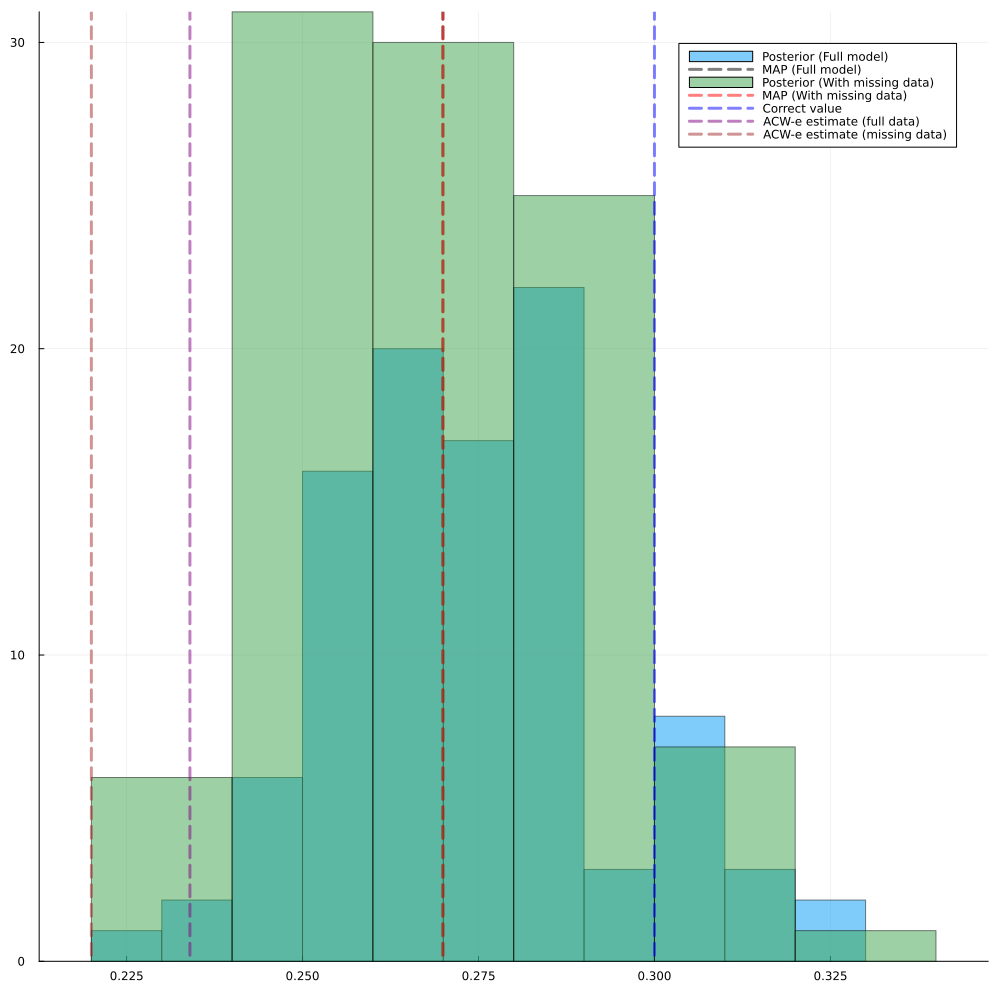

# Bayesian Estimation of Intrinsic Timescales
#### An Example With Missing Data

We almost came to the end. This is the final chapter of the tutorials. We'll go back to the starting point of this package: [abcTau](https://github.com/roxana-zeraati/abcTau). This was a Python package written by Dr. Roxana Zeraati, accompanying her paper [A flexible Bayesian framework for unbiased estimation of timescales](https://www.nature.com/articles/s43588-022-00214-3). I really liked the idea and wanted to reimplement it in Julia. The rest of the package branched out of this initial spark. A special thanks to Dr. Zeraati for patiently helping me out with a couple questions I asked her before I started this endevaour.

Let's consider the following scenario: you have some EEG data. You nicely preprocessed the data and used various artifact rejection algorithms. Usually artifact rejection algorithms chop up the data from 1 to 3 second epochs and reject those small epochs. Let's say in a second step you want to calculate the INTs from this data. Now you have a problem: both the autocorrelation function and power spectrum assume evenly sampled data. If you naively discard the epoch you reject, you will simply mess up your results due to the discontinuity in your data. You might be inclined to run ACW on short epochs but previous tutorials showed us that data length is crucial to get a good ACW estimate. A more proper way to handle the problem is to indicate your missing data points with NaNs and use techniques specialized to deal with missing data.

IntrinsicTimescales.jl offers the functions [`comp_ac_time_missing`](@ref) and [`comp_psd_lombscargle`](@ref) to deal with missing data. The first one calculates the ACFs in time domain while jumping over the missing numbers. Essentially it replicates the behavior of [statsmodels.tsa.stattools.acf](https://www.statsmodels.org/dev/generated/statsmodels.tsa.stattools.acf.html) with the option `missing="conservative"`. You can read the [source code](https://github.com/duodenum96/IntrinsicTimescales.jl/blob/master/src/stats/summary.jl#L394-L442) if you would like to see the actual implementation. The second function calculates the PSD using Lomb-Scargle periodogram. IIRC, this is a technique developed by astronomers who wanted to get the PSD but their data had missing observations simply because you can't record the positions of planets when the sky is cloudy. I don't remember where I've read this, don't quote me on this one. IntrinsicTimescales.jl uses [LombScargle.jl](https://github.com/JuliaAstro/LombScargle.jl) from [Julia Astro Organization](https://github.com/JuliaAstro) to perform the operation. 

Let's start by simulating some data with EEG characteristics. I'll simulate 30 trials, 10 seconds each with a 500 Hz sampling rate with a timescale of 0.3 seconds. For simplicity, I'll ignore oscillations. 

```julia
using IntrinsicTimescales
timescale = 0.3
fs = 500.0
dt = 1 / fs
sd = 1.0
duration = 10.0
num_trials = 30
data = generate_ou_process(timescale, sd, dt, duration, num_trials)
```

Now from each trial, let's randomly select three seconds of data and replace it with NaNs. 

```julia
using Random
Random.seed!(666)
# For each trial, randomly select a 1-second window and replace with NaNs
data_missing = copy(data)
rejection_seconds = 3
samples_to_reject = Int(fs) * rejection_seconds
for trial in 1:num_trials
    # Random start index between 1 and (total samples - 1 second worth of samples)
    start_idx = rand(1:(size(data,2) - samples_to_reject))
    # Replace 1 second of data with NaNs
    data_missing[trial, start_idx:(start_idx + samples_to_reject - 1)] .= NaN
end
```

Now let's calculate ACW-e from both the clean data and data with missing numbers and compare the results. 

```julia
acw_clean = acw(data, fs; acwtypes=:acweuler, average_over_trials=true)
println(acw_clean.acw_results)
# 0.238
acw_missing = acw(data_missing, fs; acwtypes=:acweuler, average_over_trials=true)
println(acw_missing.acw_results)
# 0.218
```

We are off by about 0.06 seconds from finite data length and another 0.02 seconds from the missing data. This is quite impressive given that we rejected about 1/3 of the data. Averaging over trials really makes the estimations stable. I leave it to you to explore the case of `average_over_trials=false`, the results can get much worse. 

Can we do better than this and hit the timescale right on the head? Bayesian timescale estimation can do this. In addition to hitting the timescale right on the head, it also gives you uncertainty of the timescale estimation. Since this is technically way more complicated than what we have done so far, I won't give as much detail as the previous tutorials. I recommend you to read [Dr. Zeraati's paper](https://www.nature.com/articles/s43588-022-00214-3) for more details. The implementation details can be found in the [Simulation Based Timescale Estimation](../simbasedinference.md) section of the documentation. Nonetheless, I'll try to demistify some of the jargon. 

## Demistifying Bayes Theorem

At the heart of Bayesian estimation, there is, not so surprisingly the Bayes theorem. There are many good explanations on internet. Here's my attempt. Let's start with the following probability:

```math
p(a, b) = p(a) p(b|a)
```

The probability of both ``a`` and ``b`` is the probability of ``a`` multiplied by the  probability of ``a`` when ``b`` is already known to be right. Example: let's say there are one Turkish, one German, one Chinese, one Cameroonian and two Canadians are in our lab right now. One of the Canadians is male and the other is female. The other members of the lab are incidentally all male. If I randomly pick a lab member, what is the probability that I get a lab member who is both Canadian and male? The probability of being Canadian is 2/6. The probability being a male if we already know the lab member is Canadian is 1/2. We can multiply these and get the probability of being both Canadian and male as 1/6. In math:

```math
p(\textrm{Canadian}, \textrm{male}) = p(\textrm{Canadian})p(\textrm{male}|\textrm{Canadian})
```

But consider the fact that ``p(a,b)=p(b,a)``, the ordering doesn't matter. The probability of being Canadian and male is the same as being male and Canadian. Then I can write the first equation alternatively as:

```math
p(a, b) = p(a) p(b|a) = p(b, a) = p(b) p(a|b)
```

A bit of simple arithmetic:

```math
p(a) p(b|a) = p(b) p(a|b) \\

p(a|b) = \frac{p(b|a) p(a)}{p(b)}
```

And this is the _Bayes theorem_. Why is this useful? Let's replace ``a`` and ``b`` with actually scientific things. Let's say, we want to estimate INT. And we have some data to do that. To avoid the neutrality of ``a`` and ``b``, I'll denote what we want to estimate, the INT as ``\theta`` and the data as ``x``. 

```math
p(\theta | x) = \frac{p(x | \theta) p(\theta)}{p(x)}
```

In human language, the probability of our INT estimate is right given the data we know is proportional to the probability of the data we observe assuming our INT estimate is correct and the probability of the INT estimate is right divided by the probability of the data. Let's break it down. 

``p(\theta | x)``: The probability of an INT estimate is right given the data we know. Throughout all these tutorials, our theme was "there is an underlying INT and I want to get it, but my estimations are noisy". We said that given the data we have on our hands, this is our best bet. Now we are formalizing this. What do we mean by data? In the first tutorial, we started by saying that individual data points are meaningless but their statistical properties are meaningful. And the statistical property of our choice was ACF (or later, PSD). So what I mean by data here is ACF/PSD. ``p(\theta | x)`` is what we want to calculate and is called the _posterior_. 

``p(x | \theta)``: The probability of the data if we assume that the INT estimate is right. We assume that we have a generative model. In fact, we do have one: OU process! This is where our beloved function [`generate_ou_process`](@ref) really comes in handy. If we plug in the INT we think, we can get the ACF and various ACW measures. We can get as many of them as we want. This is the ACF (data) we have given the INT estimate we propose. This is called the _likelihood_. I think of it as the likelihood of the data. 

``p(\theta)``: The probability of the INT. This is our prior belief of INT. If we haven't seen any data whatsoever, what is the probability that INT is, say, 5? EEG timescales are usually somewhere between 0.1 and 1 seconds. Rarely they can be less than 0.1 and more than 1. But it would be really weird to see an EEG timescale of 10 seconds. fMRI timescales on the other hand are usually between 1 to 10 seconds. This is called the _prior_: prior belief of the parameter before we see any data. 

``p(x)``: The probability of the data. This never really made sense to me. If you have a nice explanation of what it means please let me know. How I made peace with it is via the realization that we do not need to calculate it. The nice thing about probabilities is that probabilities have to add up to 1. Let's say we know ``p(x | \theta)`` and ``p(\theta)``. We also know that the total probability of both the left hand side and right hand side should add up to 1. That's one degree of freedom we do not have, we can't arbitrarily set these numbers in a way that would violate this property of probabilites. Then we can get ``p(x)`` just from this property. This uninteresting part is called _marginal likelihood_. 

And that's Bayes theorem in a nutshell. The real difficulty is how to get these probabilities. If I have an INT estimate, I can plug it into `generate_ou_process` and get another ACF but what is the _probability_ that that estimate is right?

Turns out this is a very hard problem. There are a number of numerical schemes to get those probabilities, the most famous being Hamiltonian Monte Carlo. But even Hamiltonian Monte Carlo becomes very slow when our model involves a differential equation (i.e. OU process). 

In IntrinsicTimescales.jl I offer two ways to approximate the posterior. The first one is adaptive approximate Bayesian computation (aABC), developed in  [Beaumont et al. 2009](https://arxiv.org/abs/0805.2256) and used in [Zeraati et al. 2021](https://www.nature.com/articles/s43588-022-00214-3) paper I mentioned above. The second method is automatic differentiation variational inference (ADVI), developed in [Kucukelbir et al. 2016](https://arxiv.org/abs/1603.00788) and used in the context of INTs for the first time in IntrinsicTimescales.jl. 

## Approximate Bayesian Computation (ABC)

In summary, ABC is the following:

- Specify your data. For example, the ACF from the time-series you have from your EEG dataset. 
- Specify a prior distribution. For example, a uniform distribution of timescales between 0 seconds and 10 seconds. 
- Specify a generative model. For example, the ACF obtained from an Ornstein-Uhlenbeck process. 
- Initialize an empty posterior.
- Draw a sample from the prior. Here, sample is the proposed INT value. Let's say, 3. 
- Plug your sample into your generative model. For example, run `generate_ou_process` with its first argument set to 3 and calculate the ACF from the generated time-series using `comp_ac_fft`. 
- Calculate a distance between the ACF generated from your prior sample and the ACF from your data. For example, calculate the root-mean-squared-error between them. 
- If the distance is lower than a threshold (called _epsilon_), put the sampled prior to your empty posterior distribution. If the distance is higher, reject the prior and discard it. 
- Rinse and repeat until you have enough samples in your posterior. 

In pseudocode, the whole thing can be summarized as:

```
posterior = []
WHILE length(posterior) < MINIMUM_SAMPLES
    sample = sample_from_prior()
    time_series = generative_model(sample)
    summary_statistic = calculate_summary_statistic(time_series) # for example, ACF or PSD
    distance = calculate_distance(summary_statistic, data)
    IF distance < EPSILON
        push!(posterior, sample)
    ENDIF
ENDWHILE
```

This approximates a posterior. However, there are a few issues with this basic ABC approach. First, the acceptance threshold (EPSILON) needs to be carefully chosen - too high and we accept poor samples, too low and we reject too many samples. Second, the choice of the prior can be a problem. How can we make sure we got the right prior? We start with a reasonable guess but it would be great if the prior could be used more effectively, for example, narrowed down to the places where samples would be more probable to be accepted. 

Adaptive ABC (aABC) addresses these issues by iteratively refining both the acceptance threshold (epsilon) and the proposal distribution. It starts with basic ABC using a relatively high epsilon, then:

Adaptive ABC improves on this basic approach using a number of techniques:

- Look at the accepted samples and use them to refine the prior. At each step of aABC, we can look at how much distance each sample gave and when refining the prior we can give more weight to the _good_ samples and decrease the importance of _bad_ samples. 

- Making the threshold (epsilon) stricter over time. From one ABC iteration to the next, we look at the distribution of distances each time and pick a threshold that is at a certain quantile in the distribution of distances, thus reduce the threshold further and further. 

This procedure is called adaptive since we are tuning epsilon and priors adaptively. I'm just scratching the surface here, read the papers and [Simulation Based Timescale Estimation](../simbasedinference.md) part of the documentation to get a better picture. 

Without further ado, here is the code. We look into the documentation I linked above and pick the relevant models for our case: [`one_timescale_model`](../one_timescale.md) and [`one_timescale_with_missing_model`](../one_timescale_with_missing.md) for full data and data with missing values respectively. Then we use the default settings to fit these guys. You can see how to change the default settings [here](../fit_parameters.md). We also need to specify a vector of time points. This was an early decision which was not particularly wise. Note to self, I need to change these functions to accept just the sampling rate and they should work fine. Nonetheless, getting a time vector is quite easy. If the duration between two time points is `dt` (`=1/fs`), then the time vector is simply `dt:dt:duration` where duration is how long your data is. We also need to tell the function that we are going to use ABC method. This is the third argument which can be set as `:abc`. Finally we should also specify priors. If you don't specify any priors the algorithm will automatically make an informed guess for you but specifying the priors can make your inference much easier. To specify priors, we'll use the [Distributions.jl](https://juliastats.org/Distributions.jl/stable/) package. 

```julia
using Distributions
Random.seed!(666)
fit_method = :abc
dt = 1/fs
time = dt:dt:duration
prior = Uniform(0.0, 5.0)
model_full = one_timescale_model(data, time, fit_method; prior=prior)
model_missing = one_timescale_with_missing_model(data, time, fit_method; prior=prior)
results_full = IntrinsicTimescales.fit(model_full)
results_missing = IntrinsicTimescales.fit(model_missing)
```

Note that in the `fit` function I specified explicity that the function comes from IntrinsicTimescales package. This is necessary because both `Distributions` and `IntrinsicTimescales` packages export `fit` function so we need to disambiguate by explicitly specifying where it comes from. Another note to self: I should've picked a more neutral name but I digress. Also note that this way of calculating INTs is relatively slower than our `acw` function. This is the cost of accuracy. In my computer, it takes 51 seconds for the model with no missing data and 25 minutes for the model with missing data. The main difference is the way we calculate the ACF: `comp_ac_fft` is much faster than `comp_ac_time_missing`. 

Let's check the results. The results object carries a bunch of useful information. The final result of interest is the maximum a posteriori (_MAP_) estimate. For other information coming from the result, see [the relevant part of the documentation](../fit_result.md). 

```julia
map_full = results_full.MAP[1]
# 0.27
map_missing = results_missing.MAP[1]
# 0.26
```
Our estimates got much better. We can change the parameters of ABC to play around with the estimation. To change default parameters, we use the function `get_param_dict_abc`. This gives a dictionary with default parameters. For full model, let's increase the `:convergence_window` to 10. The algorithm checks if the parameter estimates are converging across `:convergence_window` number of runs and if they are converging, it stops. For the data with missing values, look into your terminal's output and note that epsilon gets quite reduced but doesn't change much after many iterations. The number it gets stuck is roughly 0.0004. We can stop the algorithm early so that it does not tally around any further. This is done via `:target_epsilon` parameter. 

```julia
param_dict_full = get_param_dict_abc()
param_dict_full[:convergence_window] = 10
param_dict_missing = get_param_dict_abc()
param_dict_missing[:target_epsilon] = 0.0004
results_full = IntrinsicTimescales.fit(model_full, param_dict_full)
results_missing = IntrinsicTimescales.fit(model_missing, param_dict_missing)
map_full = results_full.MAP[1]
# 0.27
map_missing = results_missing.MAP[1]
# 0.26
```

The full model took about 4 minutes and the model with missing data took about 10 minutes to run. Unfortunately the estimates did not get any better. 

Another advantage of Bayesian methods is that you don't get just a posterior, you also get the uncertainty around it. Your posterior is not a point estimate but a distribution. Let's plot the posteriors:

```julia
using Plots
p1 = histogram(results_full.final_theta, label="Posterior (Full model)", alpha=0.5)
vline!(p1, [map_full], color=:black, style=:dash, linewidth=3, label="MAP (Full model)", alpha=0.5)
histogram!(p1, results_missing.final_theta, label="Posterior (With missing data)", alpha=0.5)
vline!([map_full], color=:red, style=:dash, linewidth=3, label="MAP (With missing data)", alpha=0.5)
vline!([timescale], color=:blue, style=:dash, linewidth=3, label="Correct value", alpha=0.5)

vline!([acw_clean.acw_results], color=:purple, style=:dash, linewidth=3, label="ACW-e estimate (full data)", alpha=0.5)
vline!([acw_missing.acw_results], color=:brown, style=:dash, linewidth=3, label="ACW-e estimate (missing data)", alpha=0.5)
plot(p1, size=(1000,1000))
```


As you can see, this is a very powerful tool. But (obligatory reference) with great power comes great responsibility. Here, we knew the real timescale and we can compare it with our estimates. We don't have this luxury when we are analyzing data. To make sure we have a reasonable estimate, we need to do a posterior predictive check. We will sample from the posterior, calculate ACFs from that and compare it with ACF from the data. The IntrinsicTimescales.jl function [`posterior_predictive`](@ref) handles this. 

```julia
p1 = posterior_predictive(results_full, model_full)
p2 = posterior_predictive(results_missing, model_missing)
plot(p1, p2, size=(800, 400))
```


Posterior predictive looks fine. Our work with ABC is done. Let's check out ADVI. 

## Automatic Differentiation Variational Inference (ADVI)

Note: ADVI functionality is currently experimental. Proceed with caution. 

I'll keep the theory brief here. For details, see [Fabian Dablander's brilliant blog post](https://fabiandablander.com/r/Variational-Inference.html). If you want to learn more, go read it. It will be well worth your time. 

Let's remember the Bayes theorem:

```math
p(\theta | x) = \frac{p(x | \theta) p(\theta)}{p(x)}
```

We said that denominator isn't particularly interesting and we can rewrite it based on the knowledge that the total probability should add up to 1. If we integrate over all possible values in the numerator and put what we get at denominator, then we force the total probability to be 1. (As an intuitive demonstration to see why this is true, run the following code. This kind of normalization enforces a sum to be equal to 1.):

```julia
x = randn(10000)
x_total = sum(x)
sum(x ./ x_total)
```

Back to our case:

```math
p(x) = \int{p(x | \theta) p(\theta) d\theta} \\

p(\theta | x) = \frac{p(x | \theta) p(\theta)}{\int{p(x | \theta) p(\theta) d\theta}}
```

We have this nasty integral downstairs. There is no easy way to calculate it and get the posterior. Instead, we can be more humble and say that we don't want the posterior per se but a distribution that approximates the posterior. Precisely, we want a distribution that has minimal _Kullback-Leibler Divergence_ (KL divergence or KLD) to the actual posterior. Minimizing or maximizing something as opposed to calculating that thing is called _variational inference_. KLD is a way to quantify the distance between two probability distributions. You can't calculate something like a root-mean squared distance on probabilities, KLD is your best bet. Let's write down KLD for two arbitrary probability distributions ``p(x)`` and ``q(x)``

```math
\textrm{KL}(p(x)||q(x)) = \int{p(x)\log{(\frac{p(x)}{q(x)})}} dx = \int{ p(x) \left( \log{(p(x))} - \log{(q(x))} \right)dx} \\

= \langle \log{(p(x))} - \log{(q(x))} \rangle
```

The first equality is the definition of KLD. The second equality comes from the properties of the logarithm. The crucial insight is hidden in the last equality. Here, angular brackets ``\langle \rangle`` denote averaging. Keep in mind that ``\int{p(x) f(x) dx} = \langle f(x) \rangle``. So effectively we are calculating the average difference of the logarithms of two probability distributions. Why logarithms? The probabilities are confined between 0 and 1. This makes calculations annoying. Representing them in logarithms maps them to the world of continuous numbers where addition, subtraction etc. are more natural. This is the intuition behind the KLD. 

Our goal is to find a distribution such that it minimizes the KLD between that distribution and the actual posterior. I'll denote a distribution by ``q(\theta)``. The ``q(\theta)`` that minimizes KLD is ``q^*(\theta)``. 

```math
q^*(\theta) = \underset{q(\theta)}{\textrm{argmin}}\; \textrm{KL}(q(\theta)||p(\theta|x)) = \int{q(\theta) \log{\frac{q(\theta)}{p(\theta|x)}} d \theta} = \left\langle \log{\frac{q(\theta)}{p(\theta|x)}}  \right\rangle
```

Let's massage this expression a little. First, I'll explicitly write down what's inside the logarithm, then I'll break it apart to digestible pieces and finally I'll rewrite the posterior using Bayes theorem:

```math
\left\langle \log{\frac{q(\theta)}{p(\theta|x)}}  \right\rangle \\

= \langle \log{q(\theta)} - \log{p(\theta|x)} \rangle \\

= \langle \log{q(\theta)} \rangle - \langle \log{p(\theta|x)} \rangle \\
```

Now using the Bayes theorem on ``p(\theta|x)``

```math
\langle \log{q(\theta)} \rangle - \left \langle \log{\frac{p(x|\theta)p(\theta)}{p(x)}}
    \right \rangle \\

= \langle \log{(q(\theta))} \rangle - \bigg ( 
    \langle \log{(p(x|\theta))} \rangle + \langle \log{(p(\theta))} \rangle - \langle \log{(p(x)) \rangle}
    \bigg) \\

= \langle \log{(q(\theta))} \rangle - \langle \log{(p(x|\theta))} \rangle - \langle \log{(p(\theta))} \rangle + \langle \log{(p(x))} \rangle
```

This is quite messy but I haven't done anything other than high school algebra. If it looks scary, take a piece of pen and paper and write down every line in the derivation above. 

We're still not quite there because we encountered the annoying ``p(x)`` again which we still don't know what to do about. But let's consider the alternative approach, see if we can find a way around doing the integrals of ``p(x)``. There is a quantity called _evidence lower bound_ (ELBO). It is defined as: 

```math
\textrm{ELBO}(q(\theta)) = -(\textrm{KL}(q(\theta)||p(\theta|x))-\log{p(x)})
```

Plugging in the mess above for KLD:

```math
\textrm{ELBO}(q(\theta)) = \\
-\bigg(\langle \log{(q(\theta))} \rangle - \langle \log{(p(x|\theta))} \rangle - \langle \log{(p(\theta))} \rangle + \langle \log{(p(x))} \rangle-\log{p(x)}\bigg)
```

We have some hope now. Note that ``p(x)`` does not depend on ``\theta``. The averaging we are doing is an average over ``\theta``. This means we can write ``\langle p(x) \rangle`` as ``p(x)`` (the average value of a constant is the same constant). Then finally ``p(x)``s above cancel and we get

```math
\textrm{ELBO}(q(\theta)) = -\bigg(\langle \log{(q(\theta))} \rangle - \langle \log{(p(x|\theta))} \rangle - \langle \log{(p(\theta))} \rangle \bigg)
```

What to do with this thing? We want to minimize the KLD. Maximizing ELBO will automatically minimize KLD for us since ELBO depends on ``-\textrm{KL}``. Then we can ignore ``p(x)`` and treat maximizing ELBO as an optimization problem where we can use standard techniques inspired by gradient descent in machine learning. I'm cutting the math short here, for more details seriously read [Dablander's blog post](https://fabiandablander.com/r/Variational-Inference.html). I've never seen a clearer explanation of variational inference before. 

In order to use gradient-descent like methods, we need to be able to take derivatives. This is well-known for machine learning or training neural networks. But how do you take the derivative of doing a simulation and calculating its ACF or PSD? This is where [Julia's scientific machine learning (SciML)](https://sciml.ai/) environment comes into play. If we can write our functions in a way that is nice for [automatic differentiation](https://book.sciml.ai/notes/08-Forward-Mode_Automatic_Differentiation_(AD)_via_High_Dimensional_Algebras/), then [ForwardDiff.jl](https://juliadiff.org/ForwardDiff.jl/stable/) takes the derivatives for us. For models with a small number of parameters (like the Ornstein-Uhlenbeck process we have), forward-differentiation is much more effective than backward-differentiation (or backpropogation) used in training neural networks with hundreds of thousands of parameters. I am aware that I already made this tutorial way longer than I intended to so I'll cut the explanations here, refer to the links above to enter the rabbit hole that I've been in for the last couple of months. The name _automatic differentiation variational inference_ (ADVI) comes from the fact that we are using automatic differentiation to perform variational inference. 

In practice, IntrinsicTimescales.jl uses [Turing.jl](https://turinglang.org/) to perform ADVI. Without further ado, here is the actual code to get the INTs. The syntax is the same as ABC, we'll just change `fit_method`. 

```julia
Random.seed!(666)
fit_method = :advi
model_full_advi = one_timescale_model(data, time, fit_method; prior=prior)
model_missing_advi = one_timescale_with_missing_model(data, time, fit_method; prior=prior)
results_full_advi = IntrinsicTimescales.fit(model_full)
results_missing_advi = IntrinsicTimescales.fit(model_missing)
```

Similat to the fitting in ABC method, fitting in ADVI is also customizable via the parameters in [`get_param_dict_advi`](../fit_parameters.md). If the fitting fails, you can increase the parameters `:n_elbo_samples` (how many samples to take to estimate ELBO) and `:n_iterations` (how many ADVI iterations to perform) to get better estimates. 

Finally we can also do posterior predictive check with the result objects from ADVI. 

```julia
p1 = posterior_predictive(results_full_advi, model_full_advi)
p2 = posterior_predictive(results_missing_advi, model_missing_advi)
plot(p1, p2, size=(800, 400))
```

That's all. Hope you enjoyed this as much as I did. This was the most fun thing I've ever done during my PhD. 