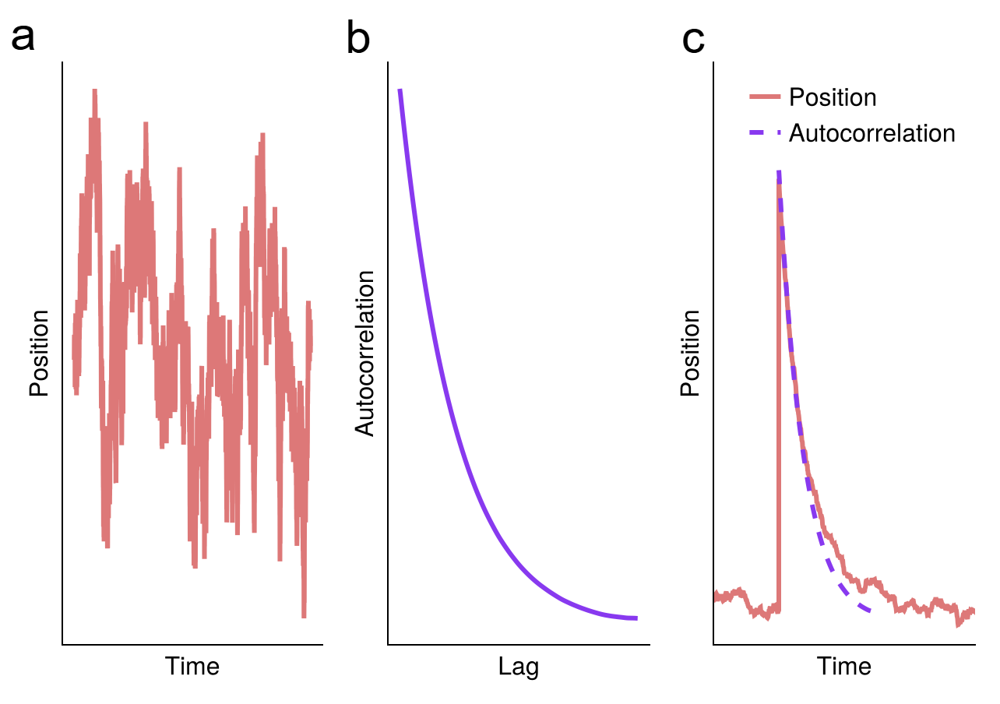
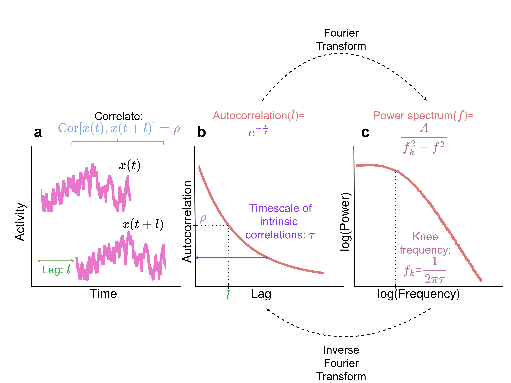

# Theory: Why and How the Autocorrelation Function and Power Spectrum can be Used to Estimate Intrinsic Neural Timescales

Note: this section is adapted from my PhD thesis. I will post a link to access it if it gets accepted. 

A note on notation: The problems we encounter in the study of intrinsic neural timescales (INTs) involve two types of averaging: time averages and ensemble averages. We will use angular brackets to refer to time averages and the expectation operator ``Ε`` to refer to ensemble averages. In particular, we define the averaging for a continuous finite time series starting at ``t=0`` and ending at ``t=T`` as ``\langle x(t) \rangle = \frac{1}{T} \int_0^T x(t) dt``. For data sampled over time either via recording an experiment or resulting from a numerical simulation, we can use ``\langle x_t \rangle \frac{1}{T} \sum_{t=1}^T x_t``. Ensemble averages refer to averaging over many instances of the same process, with different noise realizations. For example, these can refer to averaging over trials in the case of event-related potentials, or averaging over noisy simulations if we are interested in the mean activity. We can define the averaging over an ensemble with ``N`` elements at time point ``t`` as ``E[x(t)]=\frac{1}{N} \sum_{i=1}^N x^{(i)}(t)`` where ``x^{(i)}`` refers to the ``i``-th element of the ensemble of ``N`` elements. In discretized dynamics as above, we can use ``E[x_t]=\frac{1}{N}\sum_{i=1}^N x_t^{(i)}``. The properties of the white noise we list below are also satisfied for ensemble averages, i.e. ``E[x(t)]=0, E[x^{(i)}(t_1)x^{(j)}(t_2)]=\delta(t_1 - t_2) \delta_{ij}`` is the Kronecker delta function. 

## The Rationale For Using Resting State Autocorrelation Function to Estimate Intrinsic Neural Timescales

In this section, we will address the question of why we can use the resting state autocorrelation function (ACF) to index intrinsic neural timescales. Consider the simplest stochastic differential equation (SDE):

```math
\frac{dx(t)}{dt} = -\frac{1}{\tau} x(t) + \xi(t)
```

where ``\tau`` is a constant and ``\xi(t)`` is white noise with zero mean and delta autocorrelation (i.e. ``\langle \xi(t) \rangle = 0`` and ``\langle \xi(t_1) \xi(t_2) = \delta(t_1 - t_2)``). This equation describes the dynamics of a harmonic oscillator (e.g. a spring-mass system) in overdamped regime. However it can also describe linearized dynamics of any one dimensional nonlinear SDE around a fixed point via Hartman-Grobman theorem (Strogatz, 2015; Bekima, 2025). If we focus on the average behavior, the noise term will be zero and the dynamics will simply be described by ``\frac{dx}{dt} = -\frac{1}{\tau} x(t)``. We can see that if we start the process at a positive value, the change in x (i.e. ``frac{dx}{dt}``) will be negative and the process will move towards zero. Conversely, if we start at a negative value, the change will be positive and move ``x`` towards zero again. So the long-term behavior of ``x`` is always reaching zero. We can also ask how fast will x move. Since the change in ``x`` over time is proportional to the constant ``\frac{1}{\tau}``, this quantity will determine the speed of moving to the steady state: higher the ``\tau``, longer the duration. Furthermore, we can solve the average dynamics exactly to see that the form of reaching zero is ``E[x(t)]=x(0)e^{-\frac{1}{\tau}t}``. The speed depends exponentially on ``\frac{1}{\tau}``. Therefore we can say that ``\tau`` is the timescale of ``x``.

We can find the autocovariance ``\langle x(t_1) x(t_2) \rangle`` via a straightforward calculation by starting with the solution ``x(t)=x(0) e^{-\frac{1}{\tau}t} + \int_0^t dt\prime \exp(-frac{1}{\tau} (t-t\prime)) \xi(t\prime)``, multiplying ``x(t_1)`` and ``x(t_2)``, taking the ensemble average using the properties of the noise term and taking the long time limit. The result is ``\langle x(t_1) x(t_2) \rangle = \frac{\tau}{2} \exp(-frac{1}{\tau} |t_1-t_2|)``. The autocorrelation function is the normalized autocovariance function such that for ``t_1=t_2``, it is equal to 1 (i.e. the corresponding autocorrelation function is ``\exp(-frac{1}{\tau} |t_1-t_2|)``). Remarkably, this equation is the same as the average dynamics we found above up to a constant. Therefore we can just investigate temporal persistence of noisy dynamics at the steady state to understand the timescale of reaching the steady state from a non-equilibrium initial condition. The generalizability of this simple model to neuronal dynamics is a non-trivial problem. We make an attempt to address this in Çatal et al., (2025). In the figure below, we demonstrate this result via numerical simulations. 



If we take the model at face value and apply the inferences to neuroscience, what do these results tell us? The steady-state behavior of x is its state in the absence of external stimulations and corresponds to the resting-state. The average behavior of returning to the steady-state can be actualized by repeating a stimulus across multiple trials and averaging the neural activity across trials, a procedure known as evoked brain activity. By analyzing the resting state autocovariance function (or its normalized form: autocorrelation function), we can make inferences about evoked activity in the task state. This consideration also explains the empirically observed correlation between temporal receptive windows (TRWs) and INTs (Honey et al., 2012). If INTs are long, the duration it takes to return to baseline after a stimulation will be long, and there will be a longer time window in which a second stimulus can be applied and processed together with the first input, and vice versa for the short timescale.

## Empirical Estimation of Intrinsic Neural Timescales

The characterization we outlined above was based on continuous dynamics. Since empirically recorded or numerically simulated data is discrete, we need to discretize above formulas to understand how to estimate intrinsic neural timescales (INTs) empirically. We can denote the evenly sampled time points as ``t=n\Delta t`` where ``\Delta t`` is the duration between two samples (repetition time (TR) in the fMRI literature, or inverse of the sampling rate in the electrophysiology literature). ``n`` is an integer between ``1`` and ``N=\frac{T}{\Delta t}``. Therefore, we can denote our time series as ``x_n = x(n \Delta t)``. This time series starts at ``t=\Delta t`` and ends at ``t=T``. For continuous time-series, the autocovariance function is defined as ``\textrm{ACovF}(l)=\frac{1}{T-l} dt \int_0^{T-l} x(t) x(t+l)``. This can be discretized and normalized to get the empirical autocorrelation function (ACF):

```math
\textrm{ACF}(l) = \frac{\langle x_n x_{n+l} \rangle}{\langle x_n^2 \rangle} = \frac{1}{T-l} \frac{\sum_{n=1}^{N-l} x_n x_{n+l}}{\sum_{n=1}^{N-l} x_n^2 }
```

where the time lag ``l`` is in the unit of samples. The corresponding time duration can be found as ``l \Delta t``. The normalization ensures that ``\textrm{ACF}(0)=1``. Interestingly, empirically recorded neuroimaging data (e.g. fMRI, EEG, MEG, ECoG) conforms to the exponential decay function (``e^{-\frac{1}{\tau}l}``) derived for the dynamics of a noisy overdamped harmonic oscillator. In the case of electrophysiological data with high sampling rate (e.g. EEG, MEG, ECoG), this exponential decay function is accompanied by oscillations such as alpha or gamma waves.

The first paper which used the ACF to estimate INTs was Hasson et al., (2012). In order to estimate the decay rate of the ACF, Honey et al. calculated the lag where ACF crosses 0.5. This is the duration it takes for a signal to lose 50% of its similarity with itself. If the timescale is short (small ``\tau``), the ACF will decay to 0 rapidly, and vice versa. This method was termed the autocorrelation window (ACW). In 2014, Murray et al. showed the timescale hierarchy on the firing rates from single unit neural recordings. Instead of using ACW, they fit an exponential decay function to the ACF using minimum least square optimization methods (Murray et al., 2014) to directly find ``\tau`` (also see Ito et al., 2020; or Çatal et al., 2024 for others using this method). In addition to the lag where ACF crosses 0.5 (Hasson et al., 2012; Wolman et al., 2023; Çatal et al., 2025), later researchers also used 0 (Golesorkhi et al., 2021; Wolman et al., 2023; Tang et al., 2025) and ``1/e`` (Cusinato et al., 2023) as thresholds and calculated the timescale as the corresponding lag. Furthermore, the timescale is also estimated as the area under the ACF before it crosses 0 (Watanabe et al., 2019; Raut et al., 2020b; Manea et al., 2022; Wu and Gollo, 2025)

In the existence of oscillations (for example, the commonly observed alpha oscillations in EEG data), the above methods suffer from biases. Spectral parametrization method can be used to perform better timescale estimation (Donoghue et al., 2020; Gao et al., 2020). Spectral parametrization models the power spectral density (PSD) instead of ACF. Due to the Wiener-Khinchine theorem which states that the PSD and ACF are Fourier transform pairs, PSD can be used for this purpose. Since it localizes oscillations, it is better suited for timescale estimation in the absence of oscillations. The PSD that corresponds to our exponential decay form of ACF can be found by taking the Fourier transform of the exponential decay. The result of the calculation is the Lorentzian function ``\textrm{PSD}(f)=\frac{A}{f_k^2 + f^2}`` where ``f`` is the frequency, ``f_k`` and ``A`` are constants. For low frequencies where ``f < f_k``, we have ``f^2 << f_k^2``. If we neglect the ``f^2`` term since it is small, we can see that ``\textrm{PSD}(f)=\frac{A}{f_k^2}`` and is a constant function. In high frequencies, we have ``f^2 >> f_k^2`` and similarly by neglecting the small ``f_k^2`` term we get ``\textrm{PSD}(f)=\frac{A}{f^2}``. If we plot the ``\log{\textrm{PSD}(f)}`` against ``\log{f}``, we will observe that the plot appears to be constant at low frequencies and a straight line with a slope of -2 at high frequencies. The transition between these two regimes is found at ``f \approx f_k``, which looks like a knee in the log-log plot. Incidentally, this parameter has a straightforward relation to the timescale ``\tau`` via ``\tau = \frac{1}{2 \pi f}``. Therefore, finding ``f_k`` also gives us the value of ``\tau``.

The spectral parametrization method works as follows: 1) Fit an aperiodic function to the empirical PSD (in our case, the Lorentzian), 2) Subtract the aperiodic function from the PSD to better see oscillatory peaks, 3) Fit Gaussians to each oscillatory peak, 4) Subtract these Gaussians from the initial PSD to better see the aperiodic component of the PSD, 5) Fit the aperiodic function again. After the final fitting, the knee frequency f_k of the aperiodic function can be extracted. This method was developed by Gao et al., (2020) and was used in ECoG (Gao et al., 2020; Manea et al., 2024), single unit neural recordings (Gao et al., 2020) and MEG (Wiesman et al., 2022; Pauls et al., 2024) data. While the method is very successful when the PSD is a Lorentzian, it can fail when the PSD does not conform to this shape. An example of such a case is EEG or MEG data where PSD conforms to the so-called scale-free distribution (``\textrm{PSD}(f) = \frac{1}{f^\beta}``  with the power-law exponent ``\beta``) with no initial flat part (see these two discussions on the Github page of the major software package `specparam` which implements this algorithm for details: [Issue #35](https://github.com/fooof-tools/fooof/issues/35), [Issue #7](https://github.com/fooof-tools/Development/issues/7). In these cases, one can use classical regression methods by taking oscillatory powers as additional variables in the regression models in order to minimize the oscillatory bias (for the statistical perspective, see McElreath, 2020; for examples, see Çatal et al., 2024, 2025).

In addition to these methods, one can also estimate INTs using generative modeling and Bayesian inference. In this approach, the generative model is the Ornstein-Uhlenbeck (OU) process (Zeraati et al., 2022):

```math
\frac{dx(t)}{dt} = -\frac{1}{\tau} x(t) + \sigma \xi(t)
```

with timescale ``\tau``, zero-mean and unit variance uncorrelated white noise ``\xi(t)``, and the variance term ``\sigma``. Aside from the ``\sigma`` term which does not contribute to the ACF, this equation is the same as the one we used in the previous section. Therefore, the ACF is given by ``\textrm{ACF}(l) = e^{-\frac{1}{\tau}l}``. The likelihood function ``p(D|\theta)`` is the probability of observing the empirical ACF (``D``) given the parameters ``\theta=\{\tau, \theta\}``. With appropriate prior ``p(\theta)``, the unnormalized posterior density is given by the Bayes theorem ``p(\theta|D) \propto p(D|\theta)p(\theta)``. However, the likelihood function is not known analytically. Nonetheless, numerical simulation of the Ornstein-Uhlenbeck process with the same sampling rate as empirical data, then subsequently calculating the ACF from simulated time-series allows Bayesian estimation thanks to Markov Chain Monte Carlo (MCMC) or variational methods. Importantly, these methods not just give point estimates for the estimated parameters, but also provide uncertainties. Furthermore, by simulating a time-series with equal sampling rate and duration as empirical data, these methods also model the finite data bias. This bias can lead to underestimation of timescales from empirical data (Zeraati et al., 2022). The first paper that performed Bayesian inference of timescales was Zeraati et al., (2022). They used adaptive approximate Bayesian computation (aABC) and found that classical methods sytematically underestimate timescales due to the finite data bias. The generative model can be enhanced with additive oscillations or multiple timescales (as sum of multiple OU processes). In a later paper, Zeraati et al. used Bayesian model comparison in addition to generative modeling and showed that some neurons in the rat brain show two timescales (Zeraati et al., 2023).

In summary, the methods of timescale estimation use either the autocorrelation function or power spectral density and find the timescale of correlated fluctuations. the figure below presents a schema for these calculation methods.




